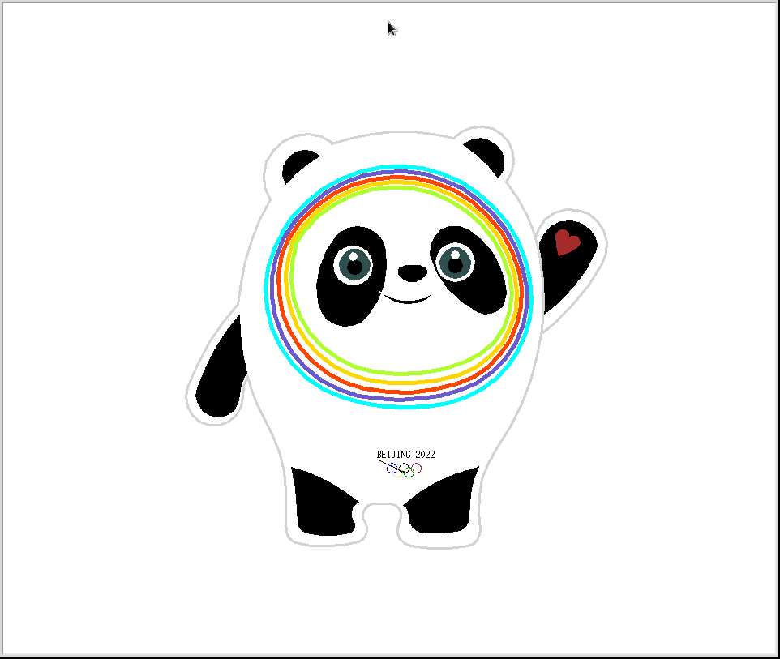

# Bing Dwen Dwen

> A painting script for Bing Dwen Dwen. 

## Background

**Bing Dwen Dwen** -- Mascot of the 2022 Beijing Winter Olympics.

Since it was widely welcomed by people all in the world, but it was difficult to achieve the goal of *One Person One Dwen*, I started to write this code in order to make my girlfriend happy in the upcoming Valentine's Day.

## Feature

- plot a **Bing Dwen Dwen**

## Dependency

|library|usage|built-in|
|:---:|:---:|:---:|
|`turtle`|plot|True|

## Install

With `git` installed, run

```shell
$ git clone https://github.com/hnlcf/Bing-Dwen-Dwen.git
```

## Usage

With `python/python3` installed, run

```shell
$ cd Bing-Dwen-Dwen

$ python/python3 main.py
```

Then it will plot as below



## Acknowledgments

The all actual code refer to the video of Bilibili(As I write this, the video has been removed), thanks to the author of the video, **Crossin的编程教室**.

## License

MIT
